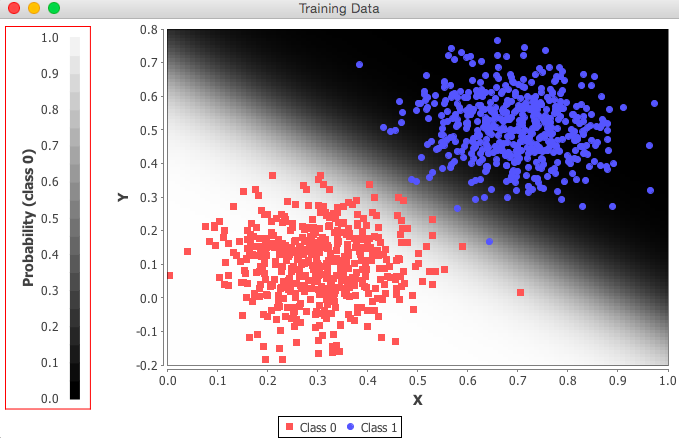

# Quickstart

## Get started

This is everything you need to run DL4J examples and begin your own projects.

We recommend that you join our [community forum](https://community.konduit.ai/). There you can request help and give feedback, but please do use this guide before asking questions we've answered below. If you are new to deep learning, we've included [a road map for beginners](beginners.md) with links to courses, readings and other resources.


We are currently reworking the Getting Started Guide. 

If you find that you have trouble following along here, take a look at the Konduit blog, as it features [some getting started guides from the community](https://blog.konduit.ai/tag/getting-started/).


### A Taste of Code

Deeplearning4j is a domain-specific language to configure deep neural networks, which are made of multiple layers. Everything starts with a `MultiLayerConfiguration`, which organizes those layers and their hyperparameters.

Hyperparameters are variables that determine how a neural network learns. They include how many times to update the weights of the model, how to initialize those weights, which activation function to attach to the nodes, which optimization algorithm to use, and how fast the model should learn. This is what one configuration would look like:

```java
    MultiLayerConfiguration conf = new NeuralNetConfiguration.Builder()
        .weightInit(WeightInit.XAVIER)
        .activation(Activation.RELU)
        .optimizationAlgo(OptimizationAlgorithm.STOCHASTIC_GRADIENT_DESCENT)
        .updater(new Sgd(0.05))
        // ... other hyperparameters
        .list()
        .backprop(true)
        .build();
```

With Deeplearning4j, you add a layer by calling `layer` on the `NeuralNetConfiguration.Builder()`, specifying its place in the order of layers \(the zero-indexed layer below is the input layer\), the number of input and output nodes, `nIn` and `nOut`, as well as the type: `DenseLayer`.

```java
        .layer(0, new DenseLayer.Builder().nIn(784).nOut(250)
                .build())
```

Once you've configured your net, you train the model with `model.fit`.

## Prerequisites

* [Java \(developer version\)](quickstart.md#java) 1.7 or later \(**Only 64-Bit versions supported**\)
* [Apache Maven](quickstart.md#apache-maven) \(automated build and dependency manager\)
* [IntelliJ IDEA](quickstart.md#intellij-idea) or Eclipse
* [Git](quickstart.md#git)

You should have these installed to use this QuickStart guide. DL4J targets professional Java developers who are familiar with production deployments, IDEs and automated build tools. Working with DL4J will be easiest if you already have experience with these.

If you are new to Java or unfamiliar with these tools, read the details below for help with installation and setup. Otherwise, **skip to** [**DL4J Examples**](quickstart.md#examples).

#### [Java](quickstart.md)

If you don't have Java 1.7 or later, download the current [Java Development Kit \(JDK\) here](http://www.oracle.com/technetwork/java/javase/downloads/jdk8-downloads-2133151.html). To check if you have a compatible version of Java installed, use the following command:

```text
java -version
```

Please make sure you have a 64-Bit version of java installed, as you will see an error telling you `no jnind4j in java.library.path` if you decide to try to use a 32-Bit version instead. Make sure the JAVA\_HOME environment variable is set.

#### [Apache Maven](quickstart.md)

Maven is a dependency management and automated build tool for Java projects. It works well with IDEs such as IntelliJ and lets you install DL4J project libraries easily. [Install or update Maven](https://maven.apache.org/download.cgi) to the latest release following [their instructions](https://maven.apache.org/install.html) for your system. To check if you have the most recent version of Maven installed, enter the following:

```text
mvn --version
```

If you are working on a Mac, you can simply enter the following into the command line:

```text
brew install maven
```

Maven is widely used among Java developers and it's pretty much mandatory for working with DL4J. If you come from a different background, and Maven is new to you, check out [Apache's Maven overview](http://maven.apache.org/what-is-maven.html) and our [introduction to Maven for non-Java programmers](../config/maven.md), which includes some additional troubleshooting tips. [Other build tools](deeplearning4j/deeplearning4j-config-buildtools) such as Ivy and Gradle can also work, but we support Maven best.

* [Paul Dubs' guide to maven](http://www.dubs.tech/guides/maven-essentials/)
* [Maven In Five Minutes](http://maven.apache.org/guides/getting-started/maven-in-five-minutes.html)

#### [IntelliJ IDEA](quickstart.md)

An Integrated Development Environment \([IDE](http://encyclopedia.thefreedictionary.com/integrated+development+environment)\) allows you to work with our API and configure neural networks in a few steps. We strongly recommend using [IntelliJ](https://www.jetbrains.com/idea/download/), which communicates with Maven to handle dependencies. The [community edition of IntelliJ](https://www.jetbrains.com/idea/download/) is free.

There are other popular IDEs such as [Eclipse](http://books.sonatype.com/m2eclipse-book/reference/creating-sect-importing-projects.html) and [Netbeans](http://wiki.netbeans.org/MavenBestPractices). However, IntelliJ is preferred, and using it will make finding help on the [community forums](https://community.konduit.ai/) easier if you need it.

#### [Git](quickstart.md)

Install the [latest version of Git](https://git-scm.com/book/en/v2/Getting-Started-Installing-Git). If you already have Git, you can update to the latest version using Git itself:

```text
$ git clone git://git.kernel.org/pub/scm/git/git.git
```

The latest version of Mac's Mojave OS breaks git, producing the following error message:

`xcrun: error: invalid active developer path (/Library/Developer/CommandLineTools), missing xcrun at: /Library/Developer/CommandLineTools/usr/bin/xcrun`

This can be fixed by running:

```text
xcode-select --install
```

## [DL4J Examples in a Few Easy Steps](quickstart.md)

1. Use the command line to enter the following:

   ```text
   git clone https://github.com/eclipse/deeplearning4j-examples.git
   cd dl4j-examples/
   mvn clean install
   ```

2. Open IntelliJ and choose Import Project. Then select the main 'dl4j-examples' directory. \(Note: the example in the illustration below refers to an outdated repository named dl4j-0.4-examples. However, the repository that you will download and install will be called dl4j-examples\).
3. Choose 'Import project from external model' and ensure that Maven is selected. 

   

4. Continue through the wizard's options. Select the SDK that begins with `jdk`. \(You may need to click on a plus sign to see your options...\) Then click Finish. Wait a moment for IntelliJ to download all the dependencies. You'll see the horizontal bar working on the lower right.
5. Pick an example from the file tree on the left.  Right-click the file to run.

   

## Using DL4J In Your Own Projects: Configuring the POM.xml File

To run DL4J in your own projects, we highly recommend using Maven for Java users, or a tool such as SBT for Scala. The basic set of dependencies and their versions are shown below. This includes:

* `deeplearning4j-core`, which contains the neural network implementations
* `nd4j-native-platform`, the CPU version of the ND4J library that powers DL4J
* `datavec-api` - Datavec is our library vectorizing and loading data

Every Maven project has a POM file. Here is [how the POM file should appear](https://github.com/eclipse/deeplearning4j-examples/blob/master/mvn-project-template/pom.xml) when you run your examples.

Within IntelliJ, you will need to choose the first Deeplearning4j example you're going to run. We suggest `MLPClassifierLinear`, as you will almost immediately see the network classify two groups of data in our UI. The file on [Github can be found here](https://github.com/eclipse/deeplearning4j-examples/blob/master/dl4j-examples/src/main/java/org/deeplearning4j/examples/quickstart/modeling/feedforward/classification/LinearDataClassifier.java).

To run the example, right click on it and select the green button in the drop-down menu. You will see, in IntelliJ's bottom window, a series of scores. The rightmost number is the error score for the network's classifications. If your network is learning, then that number will decrease over time with each batch it processes. At the end, this window will tell you how accurate your neural-network model has become:


In another window, a graph will appear, showing you how the multilayer perceptron \(MLP\) has classified the data in the example. It will look like this:



Congratulations! You just trained your first neural network with Deeplearning4j.

## Next Steps

1. Join our community forums on [community.konduit.ai](https://community.konduit.ai/).
2. Read the [introduction to deep neural networks](https://skymind.ai/wiki/neural-network).
3. Check out the more detailed [Comprehensive Setup Guide](deeplearning4j/deeplearning4j-quickstart).


**Python folks**: If you plan to run benchmarks on Deeplearning4j comparing it to well-known Python framework \[x\], please read [these instructions](benchmark.md) on how to optimize heap space, garbage collection and ETL on the JVM. By following them, you will see at least a _10x speedup in training time_.


### Additional links

* [Deeplearning4j artifacts on Maven Central](http://search.maven.org/#search%7Cga%7C1%7Cdeeplearning4j)
* [ND4J artifacts on Maven Central](http://search.maven.org/#search%7Cga%7C1%7Cnd4j)
* [Datavec artifacts on Maven Central](http://search.maven.org/#search%7Cga%7C1%7Cdatavec)
* [Scala code for UCI notebook](https://github.com/SkymindIO/SKIL_Examples/blob/master/skil_example_notebooks/scala/uci_quickstart_notebook.scala)

### Troubleshooting

**Q:** I'm using a 64-Bit Java on Windows and still get the `no jnind4j in java.library.path` error

**A:** You may have incompatible DLLs on your PATH. To tell DL4J to ignore those, you have to add the following as a VM parameter \(Run -&gt; Edit Configurations -&gt; VM Options in IntelliJ\):

```text
-Djava.library.path=""
```

**Q:** **SPARK ISSUES** I am running the examples and having issues with the Spark based examples such as distributed training or datavec transform options.

**A:** You may be missing some dependencies that Spark requires. See this [Stack Overflow discussion](https://stackoverflow.com/a/38735202/3892515) for a discussion of potential dependency issues. Windows users may need the winutils.exe from Hadoop.

Download winutils.exe from [https://github.com/steveloughran/winutils](https://github.com/steveloughran/winutils) and put it into the null/bin/winutils.exe \(or create a hadoop folder and add that to HADOOP\_HOME\)

### Troubleshooting: Debugging UnsatisfiedLinkError on Windows

Windows users might be seeing something like:

```text
Exception in thread "main" java.lang.ExceptionInInitializerError
at org.deeplearning4j.nn.conf.NeuralNetConfiguration$Builder.seed(NeuralNetConfiguration.java:624)
at org.deeplearning4j.examples.feedforward.anomalydetection.MNISTAnomalyExample.main(MNISTAnomalyExample.java:46)
Caused by: java.lang.RuntimeException: org.nd4j.linalg.factory.Nd4jBackend$NoAvailableBackendException: Please ensure that you have an nd4j backend on your classpath. Please see: http://nd4j.org/getstarted.html
at org.nd4j.linalg.factory.Nd4j.initContext(Nd4j.java:5556)
at org.nd4j.linalg.factory.Nd4j.(Nd4j.java:189)
... 2 more
Caused by: org.nd4j.linalg.factory.Nd4jBackend$NoAvailableBackendException: Please ensure that you have an nd4j backend on your classpath. Please see: http://nd4j.org/getstarted.html
at org.nd4j.linalg.factory.Nd4jBackend.load(Nd4jBackend.java:259)
at org.nd4j.linalg.factory.Nd4j.initContext(Nd4j.java:5553)
... 3 more
```

If that is the issue, see [this page](https://github.com/bytedeco/javacpp-presets/wiki/Debugging-UnsatisfiedLinkError-on-Windows#using-dependency-walker). In this case replace with "Nd4jCpu".

## Quickstart template

Now that you've learned how to run the different examples, we've made a template available for you that has a basic MNIST trainer with simple evaluation code.

The Quickstart template is available at [https://github.com/eclipse/deeplearning4j-examples/tree/master/mvn-project-template](https://github.com/eclipse/deeplearning4j-examples/tree/master/mvn-project-template).

To use the template:

1. Copy the `standalone-sample-project` from the examples and give it the name of your project.
2. Import the folder into IntelliJ.
3. Start coding!

## More about Eclipse Deeplearning4j

Deeplearning4j is a framework that lets you pick and choose with everything available from the beginning. We're not Tensorflow \(a low-level numerical computing library with automatic differentiation\) or Pytorch. Deeplearning4j has several subprojects that make it easy-ish to build end-to-end applications.

If you'd like to deploy models to production, you might like our [model import from Keras](https://deeplearning4j.org/keras-import-get-started).

Deeplearning4j has several submodules. These range from a visualization UI to distributed training on Spark. For an overview of these modules, please look at the [**Deeplearning4j examples on Github**](https://github.com/eclipse/deeplearning4j-examples).

To get started with a simple desktop app, you need two things: An [nd4j backend](http://nd4j.org/backend.html) and `deeplearning4j-core`. For more code, see the [simpler examples submodule](https://github.com/eclipse/deeplearning4j-examples/blob/master/dl4j-examples/pom.xml#L64).

If you want a flexible deep-learning API, there are two ways to go. You can use nd4j standalone See our [nd4j examples](https://github.com/eclipse/deeplearning4j-examples/tree/master/nd4j-examples) or the [computation graph API](../models/computationgraph.md).

If you want distributed training on Spark, you can see our [Spark page](../distributed-deep-learning/howto.md). Keep in mind that we cannot setup Spark for you. If you want to set up distributed Spark and GPUs, that is largely up to you. Deeplearning4j simply deploys as a JAR file on an existing Spark cluster.

If you want Spark with GPUs, we recommend [Spark with Mesos](https://spark.apache.org/docs/latest/running-on-mesos.html).

If you want to deploy on mobile, you can see our [Android page](../android/first-steps.md).

We deploy optimized code for various hardware architectures natively. We use C++ based for loops just like everybody else. For that, please see our [C++ framework libnd4j](https://github.com/eclipse/deeplearning4j/tree/master/libnd4j).

Deeplearning4j has two other notable components:

* [Arbiter: hyperparameter optimization and model evaluation](deeplearning4j/arbiter-overview)
* [DataVec: built-in ETL for machine-learning data pipelines](deeplearning4j/datavec-overview)

Deeplearning4j is meant to be an end-to-end platform for building real applications, not just a tensor library with automatic differentiation. If you want a tensor library with autodiff, please see ND4J and [Samediff](https://github.com/eclipse/deeplearning4j/tree/master/nd4j/nd4j-backends/nd4j-api-parent/nd4j-api/src/main/java/org/nd4j/autodiff). Samediff is still in beta, but if you want to contribute, please join our [community forum](https://community.konduit.ai/).

Lastly, if you are benchmarking Deeplearnin4j, please consider coming in to our [community forum](https://community.konduit.ai/) and asking for tips. Deeplearning4j has [all the knobs](deeplearning4j/deeplearning4j-config-gpu-cpu), but some may not work exactly like the Python frameworks do.

